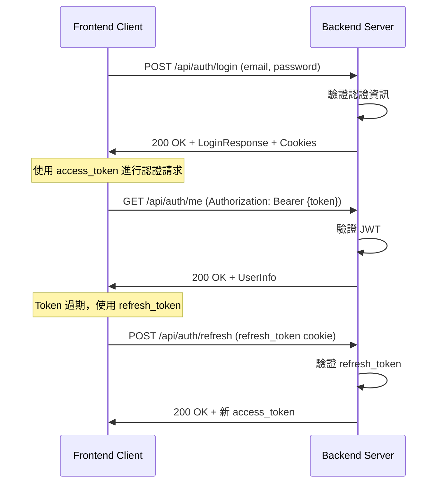

# Risk-Guard 後端 API 選單契約摘要

## 檔案資訊
- **版本**: 2.0
- **日期**: 2026-03-15
- **作者**: risk-guard-team
- **狀態**: Active
- 檔案路徑: `doc/backend-menu-contract.yml`

---

## 快速導覽

### 📋 檔案包含的主要章節

| 章節 | 內容 | 位置 |
|------|------|------|
| SECTION 1 | 認證 API 端點 | 行 24-263 |
| SECTION 2 | 動態選單 API 端點 | 行 265-341 |
| SECTION 3 | 資料模型與 DTOs | 行 343-428 |
| SECTION 4 | 架構與模組參考 | 行 580-646 |
| SECTION 5 | 佈署與環境設定 | 行 648-688 |
| SECTION 6 | 測試場景與工作流程 | 行 690-717 |
| SECTION 7 | 版本歷史 | 行 719-739 |
| SECTION 8 | 快速參考與連結 | 行 741-701 |

---

## 🔐 認證 API 端點

### 1. 登入 (POST /api/auth/login)
```
端點: POST /api/auth/login
認證: 不需要
請求主體:
  - email (可選, 字串)
  - username (可選, 字串)
  - password (必需, 字串)
回應:
  - id (數字)
  - email (字串)
  - username (字串)
  - access_token (JWT)
Cookie:
  - access_token (HttpOnly, 15 分鐘)
  - refresh_token (HttpOnly, 7 天)
```

### 2. 註冊 (POST /api/auth/register)
```
端點: POST /api/auth/register
認證: 不需要
請求主體:
  - email (必需, 格式驗證)
  - username (可選)
  - password (必需, 最少 8 字)
回應:
  - 與登入相同
```

### 3. 刷新權杖 (POST /api/auth/refresh)
```
端點: POST /api/auth/refresh
認證: 不需要 (基於 refresh_token cookie)
請求: 空
回應:
  - 新的 access_token
```

### 4. 登出 (POST /api/auth/logout)
```
端點: POST /api/auth/logout
認證: 需要 JWT
請求: 空
回應: 清除所有認證 Cookie
```

### 5. 取得使用者資訊 (GET /api/auth/me)
```
端點: GET /api/auth/me
認證: 需要 JWT
回應:
  - id, email, username
```

---

## 📑 動態選單 API 端點

### 取得選單 (GET /api/menu) - 公開端點
```
端點: GET /api/menu
認證: 不需要 (公開)
回應格式:
{
  "success": true,
  "message": "Menu fetched successfully",
  "data": [
    {
      "id": "1",
      "name": "dashboard",
      "path": "/dashboard",
      "label": "Dashboard",
      "order": 1,
      "icon": "Dashboard",
      "children": null
    }
  ]
}
```

---

## 🔒 安全規範

### JWT 設定
- **演算法**: HS256
- **Access Token 有效期**: 15 分鐘
- **Refresh Token 有效期**: 7 天

### Cookie 設定
| Cookie 名稱 | HttpOnly | Secure | SameSite | Max Age |
|-----------|----------|--------|----------|---------|
| access_token | ✓ | ✓ | Strict | 900s |
| refresh_token | ✓ | ✓ | Strict | 604800s |

### CORS 設定
- **允許來源**:
  - `http://localhost:5173`
  - `http://127.0.0.1:5173`
- **允許方法**: GET, POST, PUT, DELETE, OPTIONS
- **允許認證**: 是
- **暴露標頭**: Authorization, Set-Cookie

---

## 📦 資料模型

### LoginRequest
```yaml
email: String (可選)
username: String (可選)
password: String (必需)
```

### LoginResponse
```yaml
id: Long
email: String
username: String
access_token: String
```

### MenuApiItem
```yaml
id: String | Long
name: String (必需, 唯一)
path: String (必需, 以 / 開頭)
label: String (推薦)
icon: String (可選)
order: Integer (推薦, 升序)
canDelete: Boolean (預設: true)
description: String (可選)
children: List<MenuApiItem> (可選, 支援多層)
```

---

## 🏗️ 架構參考

### 模組責任

| 模組 | 責任 | 關鍵類別 |
|------|------|--------|
| guard-domain | 核心業務邏輯 | Entities, Repository Interfaces |
| guard-application | 應用層邏輯 | AuthApplicationService, DTOs |
| guard-infrastructure | 資料庫存取 | JPA Repository, Entity Mappings |
| guard-api | REST 端點 | AuthController |
| guard-auth | 安全認證 | SecurityConfig, JwtService, JwtAuthenticationFilter |
| guard-bootstrap | 應用啟動 | GuardApplication.class, Configuration Files |

---

## 📋 實作檢查清單

### 認證端點 ✓
- ✓ Implement POST /api/auth/login
- ✓ Implement POST /api/auth/register
- ✓ Implement POST /api/auth/refresh
- ✓ Implement POST /api/auth/logout
- ✓ Implement GET /api/auth/me
- ✓ JWT Token 生成和驗證
- ✓ 支援 email 和 username 登入

### 選單端點
- [ ] Implement GET /api/menu
- [ ] 回傳標準化的 { success, data } 結構
- [ ] 驗證路由一致性
- [ ] 按 order 欄位排序

### 安全要求 ✓
- ✓ Cookie 和 Bearer Token 認證
- ✓ JWT 驗證過濾器
- ✓ CORS 設定
- ✓ BCrypt 密碼加密
- ✓ HttpOnly Cookie 標記

---

## 🧪 關鍵測試場景

1. **auth.login_success** - 正確登入流程
   - POST /api/auth/login
   - 驗證 HTTP 200 和 access_token
   - 驗證 Cookie 設定

2. **auth.refresh_token** - 權杖刷新流程
   - 先登入取得 refresh_token
   - POST /api/auth/refresh
   - 驗證新的 access_token

3. **menu.fetch_authenticated** - 取得選單
   - GET /api/menu 帶 Authorization header
   - 驗證 HTTP 200 和選單項目

4. **auth.unauthorized_access** - 未授權拒絕
   - GET /api/auth/me 無 token
   - 驗證 HTTP 401

---

## 🚀 快速開始認證流程



---

## 📄 參考檔案

### 文件
- `/home/sixson/IdeaProjects/risk-guard/README.md`
- `/home/sixson/IdeaProjects/risk-guard/.ht-ai/project-context.yml`

### 原始碼
- `guard-api/src/main/java/com/controllers/auth/AuthController.java`
- `guard-application/src/main/java/com/applications/auth/AuthApplicationService.java`
- `guard-auth/src/main/java/com/security/SecurityConfig.java`
- `guard-bootstrap/src/main/resources/application.yml`

---

## ⚙️ 環境設定

### 開發環境
```yaml
Database: PostgreSQL (localhost:5432)
CORS Origins:
  - http://localhost:5173
  - http://127.0.0.1:5173
Debug: true
Profile: dev
```

### 生產環境
```yaml
Database: PostgreSQL (production-db-server)
CORS Origins:
  - https://production-domain.com
Debug: false
SSL: Enabled
Profile: prod
```

---

## 📝 版本歷史

| 版本 | 日期 | 狀態 | 描述 |
|------|------|------|------|
| 2.0 | 2026-03-15 | Current | 完整 Backend API & Menu Contract |
| 1.0 | 2026-02-01 | Deprecated | 初始動態側邊欄選單契約 |

---

**最後更新**: 2026-03-15
**聯繫**: risk-guard-team
